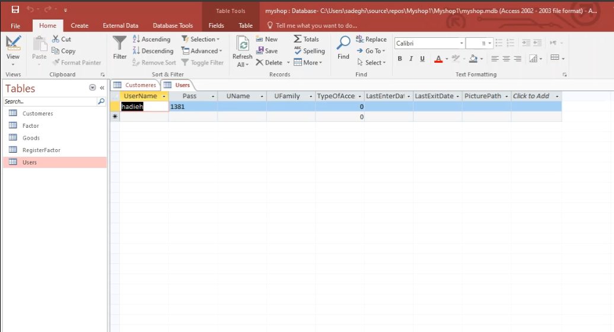
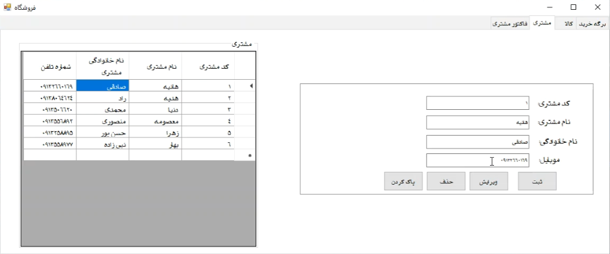
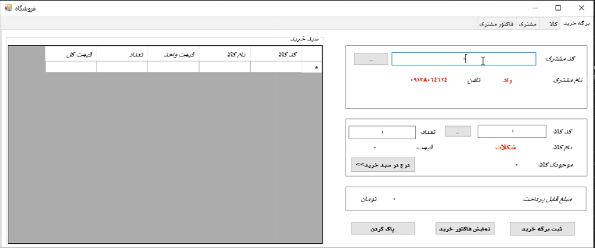
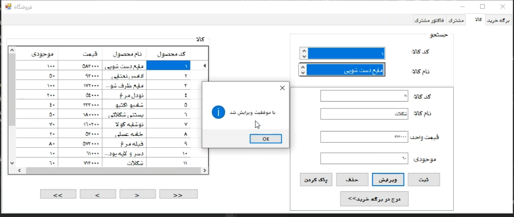
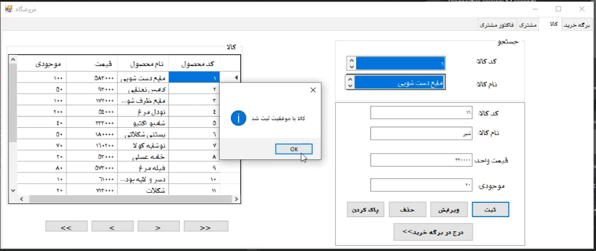
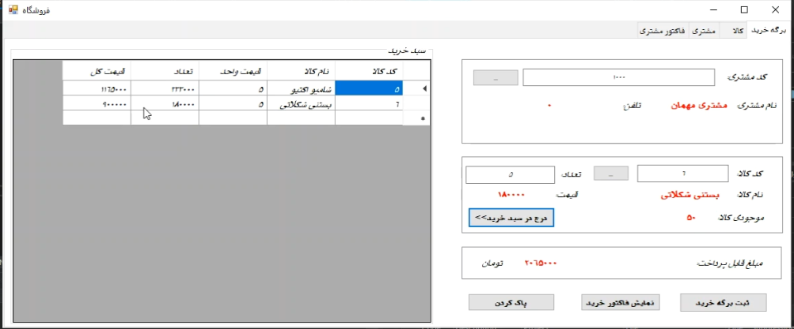
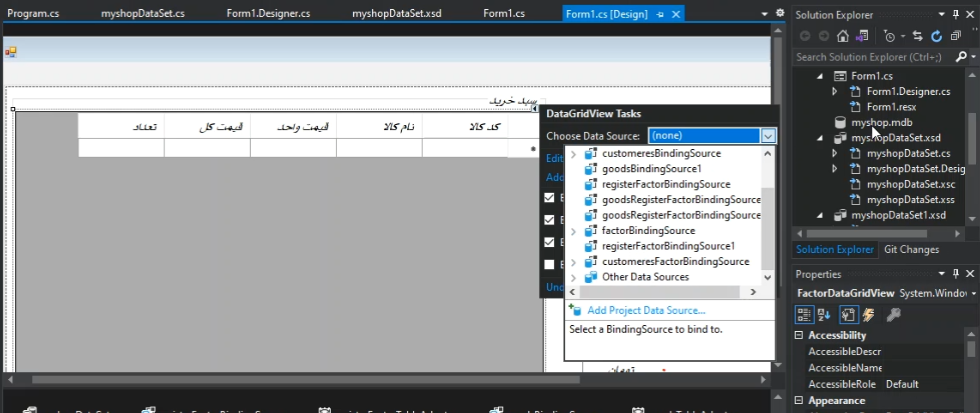

# 🛒 ShopManager System


A simple project for **store management** built with **C#** and **Microsoft Access**.  
This system includes product management, customer management, invoices, and admin login.  

---

## ✨ Features
- 🏬 **Product Management**: Add, edit, delete, and check inventory  
- 👥 **Customer Management**: Register, edit, delete, and view customer list  
- 🛒 **Shopping Cart**: Add products to the cart, view total price  
- 🧾 **Invoice Management**: Create invoices, view details, and clear invoices  
- 🔑 **Admin Login**: Authentication with username and password  

---

## ⚙️ Technologies
- 💻 Programming Language: **C#**  
- 🗄️ Database: **Microsoft Access**  
- 🛠️ IDE: **Visual Studio**  

---
## Project Screenshots

### Admin Panel



### Customer



### Products & Invoice






### Database



## 🚀 How to Run
1. Clone or download the repository:
   ```bash
   git clone https://github.com/HadieSadeghi4/shop-manager-system.git
